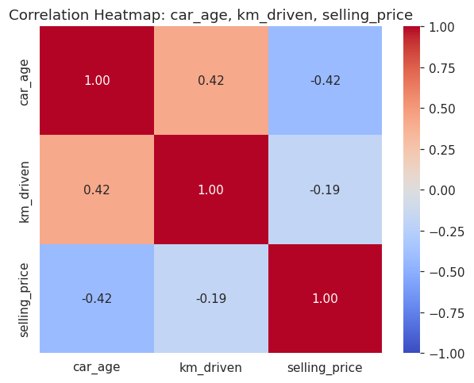
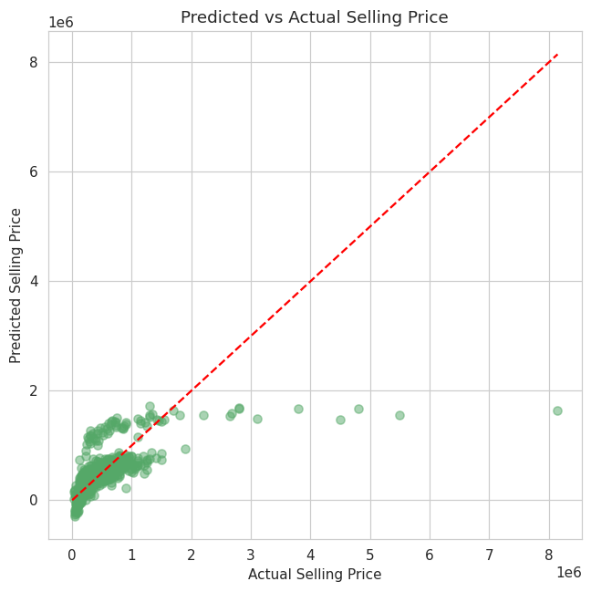
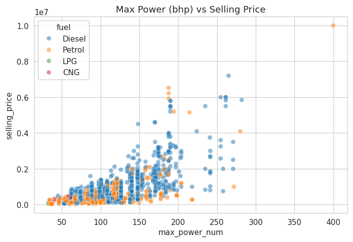
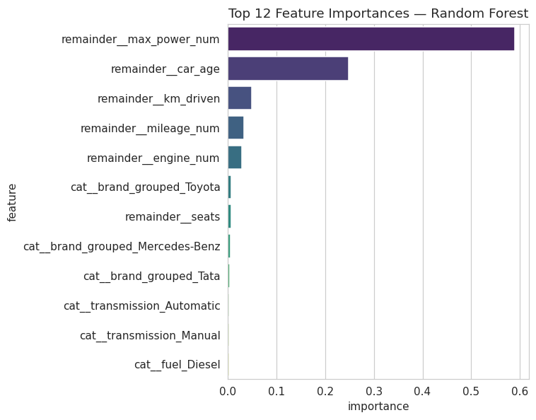

# Car Price Prediction

## Problem Statement
A used-car marketplace wants to help sellers price their vehicles fairly based on the car's age, mileage, fuel type, and other listing details, so that sellers get realistic price suggestions and buyers can spot overpriced listings.

## Dataset
- **Name:** Vehicle Dataset from CarDekho
- **Source:** Kaggle (nehalbirla)
- **Link:** https://www.kaggle.com/datasets/nehalbirla/vehicle-dataset-from-cardekho
- **Files used:**
  - `CAR_DETAILS_FROM_CAR_DEKHO.csv` — 4,340 rows, matches the handbook spec exactly (`name`, `year`, `selling_price`, `km_driven`, `fuel`, `seller_type`, `transmission`, `owner`)
  - `Car_details_v3.csv` — 8,128 rows, same core fields plus `mileage`, `engine`, `max_power`, `torque`, `seats` (used for the enhanced comparison notebook)

## Tools Used
- Python
- Pandas, NumPy
- Matplotlib, Seaborn
- Scikit-learn

## Workflow
1. Data Collection
2. Data Cleaning
3. Exploratory Data Analysis (EDA)
4. Feature Engineering
5. Model Building (Linear Regression, required; Random Forest, bonus comparison)
6. Evaluation
7. Insights & Recommendations

## Two Notebooks in This Submission

### `Notebook/car_price_prediction.ipynb` — Handbook-Strict Version
Follows the Project 3 spec exactly on `CAR_DETAILS_FROM_CAR_DEKHO.csv`, no column substitutions:
- **Model:** Linear Regression
- **R² = 0.42, MAE ≈ ₹206,155, RMSE ≈ ₹431,870**
- Uses every column the handbook names, including `seller_type`, `transmission`, and `owner`, in both the EDA and the model.

### `Notebook/car_price_prediction_enhanced.ipynb` — Bonus Comparison
Same workflow, richer dataset (`Car_details_v3.csv`, which adds `engine`, `max_power`, `mileage`, `seats`), and a side-by-side Linear Regression vs Random Forest comparison:

| Model | R² | MAE | RMSE |
|---|---|---|---|
| Linear Regression | 0.686 | ₹167,798 | ₹262,529 |
| **Random Forest** | **0.928** | **₹73,394** | **₹126,085** |

Verified with 5-fold cross-validation (not just one lucky split): **mean R² = 0.890 ± 0.025**.

**Why the jump is legitimate, not overfitting:** `max_power` alone correlates 0.75 with price (vs. −0.42 for `car_age` in the baseline) — it's simply a much more direct predictor of a car's value. Random Forest's feature-importance output agrees with the correlation analysis independently, and cross-validation confirms the score is stable across different data splits.

## Additional Requirement
A correlation analysis between numeric features was performed **before** training, in both notebooks — see Section 4 of each.

## Screenshots

## Live App

This project also includes a working Flask web app (`app/`) that serves
the Random Forest model — pick a brand and model/trim, its real specs
(engine, power, mileage) auto-fill, add the listing-specific details
(year, km driven, ownership, seller type), and get a live price
prediction. See `app/HOW_TO_RUN.md` to run it.

## Future Improvements
- Hyperparameter-tune the Random Forest (or try Gradient Boosting / XGBoost) for a further, smaller gain.
- Bring in `car_details_v4.csv` (Location, Color, Drivetrain, dimensions) for even richer features.
- Log-transform `selling_price` to address its right-skew.

## Author
[ATUL KUMAR] | [linkedin.com/in/atul-kumar-210243292]
